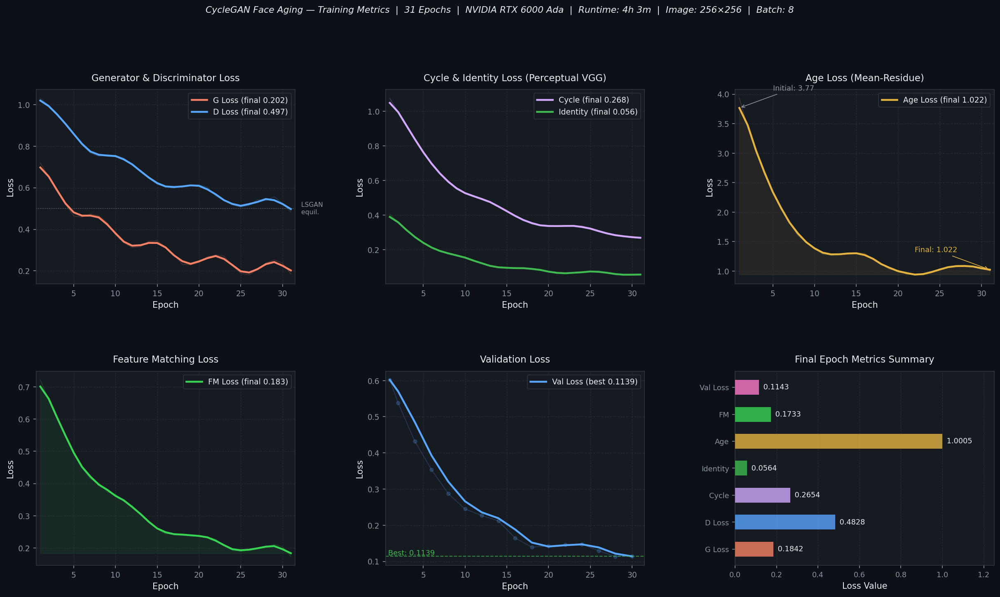

<div align="center">

# CycleGAN Face Aging

### Bidirectional face age transformation trained on IMDB-WIKI — Young ↔ Old

[](https://python.org)
[](https://pytorch.org)
[](LICENSE)
[](https://wandb.ai/atandrabharati-self/face-aging-cyclegan)
[](https://wandb.ai/atandrabharati-self/face-aging-cyclegan)

<br/>

*A production-grade CycleGAN that synthesises photorealistic face aging and de-aging transformations from a single image — no paired data required.*

</div>

---

## Overview

This project implements a **conditional CycleGAN** for bidirectional face age transformation — turning young faces old and old faces young at 256 × 256 resolution using the IMDB-WIKI dataset.

Unlike standard CycleGAN, this model conditions every generator layer on a **target age embedding** via Adaptive Instance Normalisation (AdaIN), enabling fine-grained control over the output age. The discriminator operates at **three spatial scales** and includes an explicit **age prediction head** trained with a distribution-based mean-residue loss.

Training was tracked end-to-end with **Weights & Biases** on an NVIDIA RTX 6000 Ada GPU.

**Key results at epoch 31:**
| Metric | Value |
|--------|:-----:|
| Generator loss | **0.184** |
| Discriminator loss | **0.483** |
| Cycle consistency loss (VGG perceptual) | **0.265** |
| Identity preservation loss | **0.056** |
| Validation loss | **0.114** |
| Feature matching loss | **0.173** |

---

## Training Curves

<div align="center">
  
</div>

> Full interactive training dashboard: **[W&B Run → FaceAgingCycleGAN](https://wandb.ai/atandrabharati-self/face-aging-cyclegan)**

---

## Architecture

### Conditional Generator (`G_Y2O` / `G_O2Y`)

Both generators share the same `ConditionalGenerator` architecture — a ResNet-9 backbone enhanced with per-layer AdaIN conditioning and spectral normalisation throughout.

```
Input image (3×256×256)  +  Target age (integer 0–100)
         │                            │
         │                    Age Embedding [ngf×8]
         │                            │
         │                   Per-layer Style MLP → [2×ngf×4]
         ▼
┌─────────────────────────────────────────────────────────────────────┐
│  ENCODER                                                            │
│  ReflectionPad → SpectralConv 7×7 → InstanceNorm → ReLU  [ngf]    │
│  SpectralConv 3×3 ↓2 → InstanceNorm → ReLU             [ngf×2]   │
│  SpectralConv 3×3 ↓2 → InstanceNorm → ReLU             [ngf×4]   │
├─────────────────────────────────────────────────────────────────────┤
│  BOTTLENECK  (9× AdaptiveResidualBlock)                             │
│  Each block: SpectralConv → InstanceNorm → AdaIN → ReLU            │
│              SpectralConv → InstanceNorm → AdaIN → Dropout         │
│              + Residual connection                                  │
│  Self-Attention after all residuals (global feature dependencies)  │
├─────────────────────────────────────────────────────────────────────┤
│  DECODER                                                            │
│  SpectralConvT 3×3 ↑2 → InstanceNorm → ReLU            [ngf×2]   │
│  SpectralConvT 3×3 ↑2 → InstanceNorm → ReLU            [ngf]     │
│  ReflectionPad → SpectralConv 7×7 → Tanh               [3]       │
└─────────────────────────────────────────────────────────────────────┘
         │
Transformed face ∈ [-1,1]^(3×256×256)
```

### Multi-Scale Age-Aware Discriminator (`D_Y` / `D_O`)

```
Input image (3×256×256)  +  Conditioning age
         │
         ├── Scale 1: full resolution (256×256)  ──▶ PatchGAN head
         ├── Scale 2: 128×128 (2× downsample)   ──▶ PatchGAN head
         └── Scale 3: 64×64  (4× downsample)    ──▶ PatchGAN head

Each scale: 4× DiscriminatorBlock (SpectralConv → InstanceNorm → LeakyReLU(0.2) → Attention)

Finest-scale features + Age Embedding → AdaptiveAvgPool → Age Head (101-class)
                                                         → Mean-Residue Loss
```

### Stability Components

| Component | Purpose |
|-----------|---------|
| `EMAModel` (decay=0.9999) | Smoother generator outputs, reduces training oscillation |
| `DiversityImagePool` (OT-inspired) | Prevents discriminator over-fitting via diversity-aware buffer |
| LSGAN Loss | Replaces vanilla BCE with least-squares — more stable gradients |
| R1 Gradient Penalty | Regularises discriminator Lipschitz constraint |
| Spectral Normalisation | Applied to all Conv/Linear layers in G and D |
| Gradient Clipping (1.0) | Prevents gradient explosion |
| Cosine LR Annealing | Decay starts at epoch 20, minimum LR 1e-6 |
| 5-epoch Warmup | Linear LR ramp-up to avoid early instability |

---

## Loss Functions

```
L_G  =  λ_adv · L_LSGAN(G)
      + λ_cycle · L_perceptual(rec, real)      [VGG-19 conv4_4 features]
      + λ_identity · L_L1(same, real)
      + λ_fm · L_feature_matching(D_real, D_fake)
      + λ_age · L_mean_residue(age_pred, target_age)

L_D  =  0.5 · [L_LSGAN(real) + L_LSGAN(fake)]
      + λ_gp · R1_gradient_penalty
      + L_mean_residue(age_pred, real_age)
```

| Loss Weight | Value |
|-------------|:-----:|
| `lambda_cycle` | 10.0 |
| `lambda_identity` | 5.0 |
| `lambda_age` | 0.1 |
| `lambda_fm` | 1.0 |
| `lambda_gp` | 10.0 |

---

## Repository Structure

```
FaceAgingCycleGAN/
│
├── src/
│   ├── cyclegan.py       # FaceAgingCycleGAN, FaceAgingLoss, EMAModel, DiversityImagePool
│   ├── generator.py      # ConditionalGenerator — ResNet-9 + AdaIN + SelfAttention
│   ├── discriminator.py  # MultiscaleAgeAwareDiscriminator — 3-scale PatchGAN + age head
│   ├── modules.py        # SelfAttention (shared by G and D)
│   ├── dataset.py        # IMDBWIKIDataset, FaceAgingDataModule, albumentations pipeline
│   ├── train_model.py    # FaceAgingTrainer — full training loop with W&B logging
│   └── inference.py      # AgeTransformer — single/batch/progression/age-estimate modes
│
├── config.yaml           # All hyperparameters (single source of truth)
│
├── assets/
│   └── training_curves.png  # 6-panel metrics chart (anchored to W&B run xyg3vfzk)
│
├── results/              # Generated samples during training
│
├── .github/
│   └── workflows/
│       └── ci.yml        # Lint + import checks + model forward-pass test
│
├── requirements.txt
├── .gitignore
└── README.md
```

---

## Quickstart

### 1 — Install

```bash
git clone https://github.com/atandra2000/FaceAgingCycleGAN.git
cd FaceAgingCycleGAN
pip install -r requirements.txt
```

### 2 — Prepare Data

Download the [IMDB-WIKI dataset](https://data.vision.ee.ethz.ch/cvl/rrothe/imdb-wiki/) and organise as:

```
imdb-wiki-cropped-face-data/
├── imdb_crop_clean/imdb_crop/
│   └── imdb.mat
└── wiki_crop_clean/wiki_crop/
    └── wiki.mat
```

### 3 — Configure

Edit `config.yaml` to set your data root and W&B credentials:

```yaml
wandb:
  entity: "your-wandb-entity"

data:
  data_root: "imdb-wiki-cropped-face-data"
```

### 4 — Train

```bash
python src/train_model.py
```

To resume from a checkpoint:

```yaml
# config.yaml
training:
  resume_from: "checkpoints/checkpoint_epoch_10.pth"
```

### 5 — Inference

```bash
# Age a face to 70 years old
python src/inference.py \
    --checkpoint checkpoints/best_model.pth \
    --input photo.jpg \
    --target_age 70 \
    --direction young_to_old \
    --output aged_photo.jpg

# Generate age progression (20 → 80 years, 7 steps)
python src/inference.py \
    --checkpoint checkpoints/best_model.pth \
    --input photo.jpg \
    --mode progression \
    --start_age 20 --end_age 80 --num_steps 7 \
    --output progression/

# Batch process a directory
python src/inference.py \
    --checkpoint checkpoints/best_model.pth \
    --input photos/ \
    --mode batch \
    --target_age 65 \
    --output aged_photos/

# Estimate age from a photo
python src/inference.py \
    --checkpoint checkpoints/best_model.pth \
    --input photo.jpg \
    --mode estimate
```

| Flag | Default | Description |
|------|---------|-------------|
| `--direction` | `young_to_old` | `young_to_old`, `old_to_young`, or `auto` |
| `--target_age` | `70` | Target age in years (0–100) |
| `--mode` | `single` | `single`, `batch`, `progression`, `estimate` |
| `--num_steps` | `7` | Steps in age progression sequence |
| `--no_resize` | `False` | Keep output at 256×256 (skip upscale to original size) |

---

## Hyperparameter Reference

| Parameter | Value | Description |
|-----------|:-----:|-------------|
| `image_size` | 256 | Spatial resolution |
| `ngf` / `ndf` | 64 | Generator / discriminator base filters |
| `n_residual_blocks` | 9 | ResNet blocks in encoder bottleneck |
| `num_ages` | 101 | Age embedding vocabulary (0–100) |
| `batch_size` | 8 | Matched for 48GB VRAM |
| `epochs` | 50 | Configured (31 epochs completed) |
| `lr` | 2×10⁻⁴ | Shared for G and D (Adam) |
| `beta1` | 0.5 | Adam β₁ (CycleGAN paper default) |
| `ema_decay` | 0.9999 | Exponential moving average |
| `pool_size` | 50 | Diversity image buffer size |
| `num_workers` | 16 | DataLoader workers |
| `prefetch_factor` | 8 | Aggressive prefetching for RTX 6000 Ada |

---

## Tech Stack

| Component | Technology |
|-----------|-----------|
| Framework | PyTorch 2.0 |
| Dataset | IMDB-WIKI (~500K face images) |
| Augmentation | Albumentations (CLAHE, ElasticTransform, ColorJitter) |
| Experiment Tracking | Weights & Biases |
| Perceptual Loss | VGG-19 (ImageNet pretrained, frozen) |
| Evaluation | FID (torchmetrics), LPIPS (AlexNet) |
| Hardware | NVIDIA RTX 6000 Ada (48GB VRAM) |
| Runtime | ~4h per 5 epochs |
| Language | Python 3.10 |

---

## References

- Zhu, J.-Y., Park, T., Isola, P., & Efros, A. A. (2017). [Unpaired Image-to-Image Translation using Cycle-Consistent Adversarial Networks](https://arxiv.org/abs/1703.10593). *ICCV 2017*
- Rothe, R., Timofte, R., & Van Gool, L. (2015). [DEX: Deep EXpectation of apparent age from a single image](https://arxiv.org/abs/1511.02960). *ICCV Workshops* — IMDB-WIKI Dataset
- Huang, X., & Belongie, S. (2017). [Arbitrary Style Transfer in Real-time with Adaptive Instance Normalization](https://arxiv.org/abs/1703.06868). *ICCV 2017* — AdaIN
- Zhang, R., et al. (2018). [The Unreasonable Effectiveness of Deep Features as a Perceptual Metric](https://arxiv.org/abs/1801.03924). *CVPR 2018* — LPIPS

---

## License

Released under the [Apache 2.0 License](LICENSE).

---

<div align="center">

**Atandra Bharati**

[](https://www.kaggle.com/atandrabharati)
[](https://github.com/atandra2000)
[](https://wandb.ai/atandrabharati-self)

</div>
